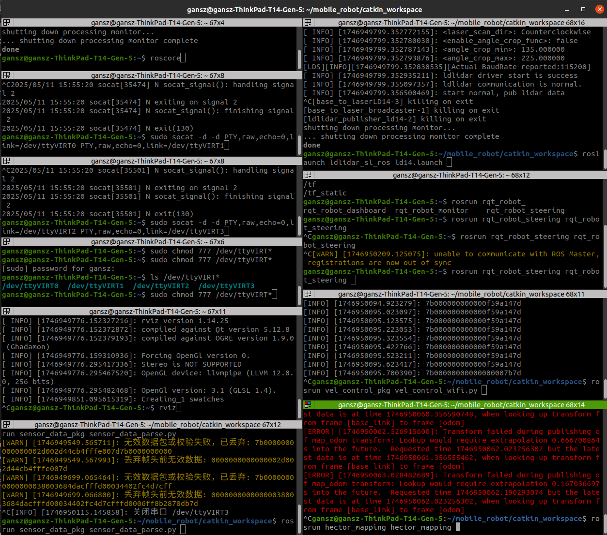

# LiDAR Mobile Robot

The course project of `EE202-17L` - Digital Circuits Laboratory.  
***Lead Author:***  **Shengzhe GAN** (Communication, ROS and algorithm implementation)  
***Collaborators:***  **Xujie WANG** (Hardware and embedded systems), **Xiaokun LIU** (Hardware), **Kairui XIAO** (Hardware)  

## Communication between ESP32, Mobile robot base and Laptop

**Function of this repo**:  
- Realize the wireless communication between a Mobile robot and a laptop running Ubuntu 20.04
- In the ROS workspace, a basic LiDAR-slam algorithm will be implemented.

## Approach overview 

**Hardware**  
- A L150 DIFF Mobile Robot Base by Wheeltech Technology Co., LTD.  
- LD14 2-D LiDAR.
- ESP32-Wroom-32 dev board.
- Laptop running ROS noetic.  

**Strategy**  
- Communication via multiport strategy to exchange LiDAR data, Base data and command data.
- The command data is sent via Wi-Fi directly.
- The recieved LiDAR and base data are pushed into two pair of virtual serial.
- The ROS packages read these data via virtual serial.

**Pipeline**  
- LiDAR connect to ESP32 dev board via UART.
- The car is embedded with ROS interface, connect to the ESP32 dev board via serial. A converter is used.
- The ESP32 connect to local Wi-Fi which is same to the Laptop running ROS.
- The ESP32 send LiDAR and base date via two port, receive command data via a third data.
- The laptop runs 5 ros packages:  
  - communication: Realize the LiDAR and base data reception.  
  - vel_control_pkg: Realize the command data transmition.  
  - sensor_data_parse: Realize the parse for the feedback base data, publish `\odom`, `\imu`amd `\battary` topics.  
  - ldlidar_sl_ros: The official driver for the ld14 2-D LiDAR.
  - slam_and_motion_control_pkg: The slam and ego-motion planning package, is the core algorithm of this project.

---
## Version Updates and Usage Guidance
### version 1.0
**Limitation**:  
Only achieved the serial penetration, single side communication.

**Pipeline**:
- Sensor send data to ESP32 via uart serial
- ESP32 send these data to WiFi
- Laptop receive these data via WiFi
- Transmit these data via virtual serial
- Resultantly ROS sensor driver can receive these data via the virtual serial

**Get started**:  
Notice:  
- Ensure the laptop and ESP32 are connected to same Wi-Fi.
- `wifi.py` is the MicroPython script running on ESP32.
- `wifi_receive_virtual_serial.py` is the Python script running on laptop.
- Only send data when the ESP32 receiced uart data.

Steps to implement, in `Ubuntu20.04`:  
- Upload `wifi.py` to ESP32, change the wifi condition variable's name of `SSID` and `PASSWARD`.
- Chanege the `uart` initiallization to your preferred tx and rx pin.
- Run this program once, write down the ESP32's IP address.
- Then save file to ESP32, rename as `main.py` to ensure autumatically run after boot.
- Create virtual serial and give them sudo access.
  - Create virtual serial: run in terminal: `sudo socat -d -d PTY,raw,echo=0,link=/dev/ttyVIRT0 PTY,raw,echo=0,link=/dev/ttyVIRT1`
  - Implement sudo access: run in another terminal: `sudo chmod 777 /dev/ttyVIRT*`
- Run `wifi_receive_virtual_serial.py` on laptop
  - Remember to change `TCP_IP` variable as the noted IP address of you ESP32.
  - Remember to change `virtual_com` signature in `__init__()` function as your virtual serial name(`'/dev/ttyVIRT0'`)
- You can examine the output by cancel the code comments in `run()` function.
- Read the virtual serial data in the other virtual serial which is created in pair(`'/dev/ttyVIRT1'`)

---
### version 2.0
**Limitation**:  
Still in prograss. The basic communication logic is finished, using the multiple-port strategy.  

**What's new?** & **Pipeline**:  
- Use different port to communicate in three way --- LiDAR tx, CMD rx and Encoder tx.  
- Wrote a python package to utililze the Wi-Fi reciever class, to be easily instantiated both in `vel-cmd` node and LiDAR receiver.  
- Created the ROS node of the `vel_cmd` subscriber  
  1. Directly Use the serial from Laptop linked with the base. (Verified)  
  2. Use Wi-Fi port to send data to esp32 and use UART output to the base. (Verified with serial assistant, but due to the cable issue, the data can't received by the base.)  
- `wifi_receiver.py` is not oop one, `communication.py` is new, and can be run by `rosrun`.  
- `wifi_transmitter.py` is the code runs on the esp32. This used multi-thread. And used 2 pair of UART pins.  

**Get started**:   
Notice:  
- Ensure the laptop and ESP32 are connected to same Wi-Fi.  
- `wifi_transmitter.py` is the MicroPython script running on ESP32.  
- `communication.py` is the Python script running on laptop, can be run by `rosrun communication communication.py`.  
- Only send data when the ESP32 receiced uart data.  

Steps to implement, in `Ubuntu20.04`:   
- Upload `wifi_transmitter.py` to ESP32, change the wifi condition variable's name of `SSID` and `PASSWARD`.  
- Chanege the `uart` initiallization to your preferred tx and rx pin.  
- Run this program once, write down the ESP32's IP address.  
- Then save file to ESP32, rename as `main.py` to ensure autumatically run after boot.   
- Create two pairs of virtual serial and give them sudo access.   
  - Create virtual serial: run in terminal: `sudo socat -d -d PTY,raw,echo=0,link=/dev/ttyVIRT0 PTY,raw,echo=0,link=/dev/ttyVIRT1`  
  - Create virtual serial: run in terminal: `sudo socat -d -d PTY,raw,echo=0,link=/dev/ttyVIRT2 PTY,raw,echo=0,link=/dev/ttyVIRT3`  
  - Implement sudo access: run in another terminal: `sudo chmod 777 /dev/ttyVIRT*`  
- Run `communication.py` on laptop  
  - Remember to change `TCP_IP` variable as the noted IP address of you ESP32.  
  - Remember to change `virtual_com` signature in `__init__()` function as your virtual serial name(`'/dev/ttyVIRT0'`)  
  - Run in terminal: `rosrun communication communication.py`.   
- You can examine the output by cancel the code comments in `run()` function.  
- Read the virtual serial data in the other virtual serial which is created in pair(`'/dev/ttyVIRT1'`)  
- Theoretically, the encoder data is streamed into the second pair of virtual serial, but this is not verified yet.

Check data with RViz:  
- Run `roscore`    
- After all above finished:  
  - `cd catkin_workspace` Enter the ws, change to your only path.  
  - `source devel/setup.sh`  
  - Run the LiDAR's drive: `roslaunch ldlidar_sl_ros ld14.launch`  
  - Open RViz `rviz`  
  - In RViz, change the base to `Laser_base`  
  - Add `LaserScan`, choose topic `/scan`   
  - Finished.  

---
### Version 2.1  

**What's new?**:  
- The serial communication between the base and ESP32 is finished

**Get Started**:
- Followed by `Version2.0`
- UART serial communication: 
  - Cable connection:  
    - Base's pin `PA2`: Tx, connect to ESP32's Pin 25; 
    - Base's pin `PA3`: Rx, connect to ESP32's Pin 26.

---
### Version 2.2
2025/5/11 Work
- 修改了odom发布的数据
- 在`vel_control_wifi.py`的launch文件里加上了tf变换，使得建图可以正常运行，使用的是`hector mapping`
- 运行顺序：
    1. 创建虚拟串口并设置sudo权限
    2. 确保esp32运行并且与计算机处于同一网络环境下，ip地址在`/util/bridge.py`下替换为实际地址
    3. 在终端中运行`rosrun communication communication.py`
    4. 在终端中运行`rosrun vel_control_pkg vel_control_wifi.py`
    5. 在终端中运行`rosrun sensor_data_pkg sensor data parse.py`
    6. 如需要自己控制，启动`rqt_robot_steering`
    7. 运行lidar的驱动
    8. 可以在rviz中验证数据
  

